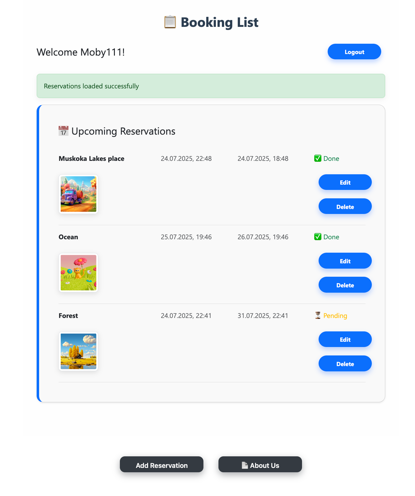
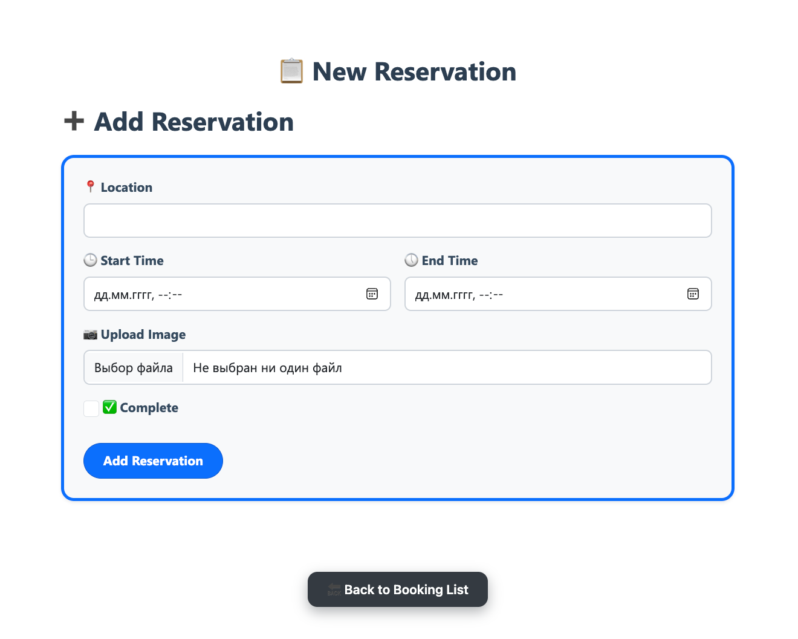
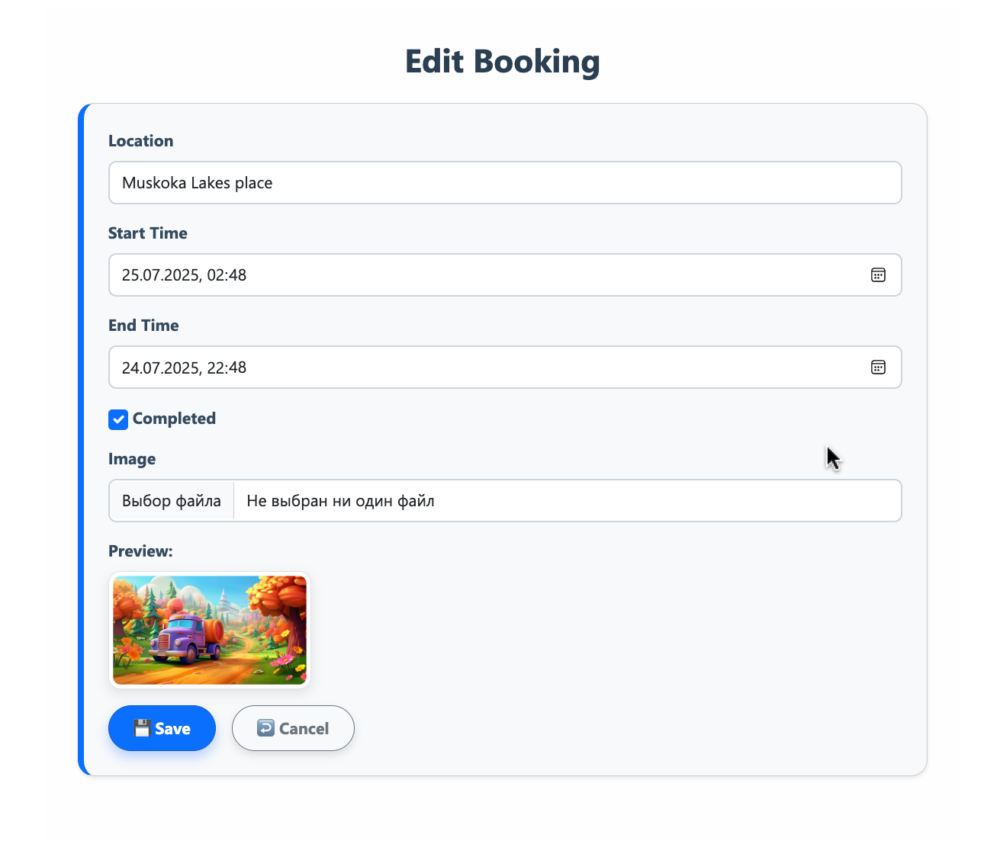
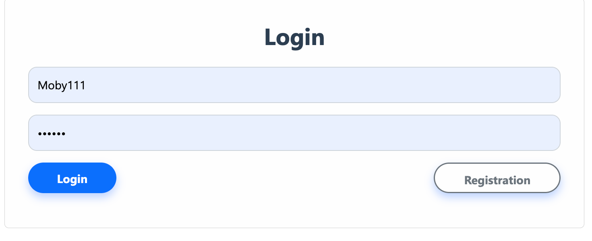

# Booking App

Angular Development Assignment 2 – Booking System with Database

---

## 📸 Application Preview

### 🔹 Booking List Page

  

---

### 🔹 Add Reservation Form

  

---

### 🔹 Edit Reservation Page

  

---

### 🔹 Login Page

  

---

## 🛠 Tech Stack

- Angular
- TypeScript
- PHP
- MySQL
- REST API
- File Upload Handling
- Form Validation
- Authentication & Session Handling

---

## ✅ Booking App Testing Report
